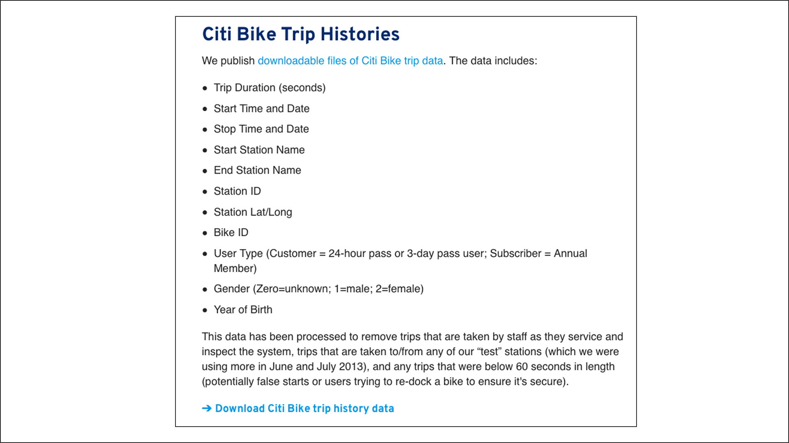
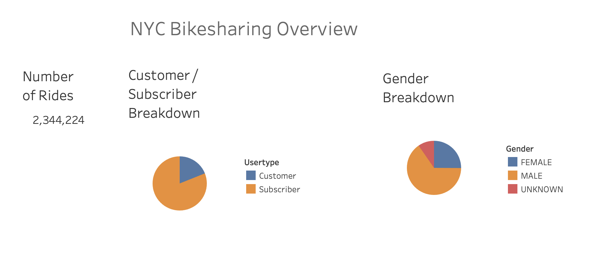
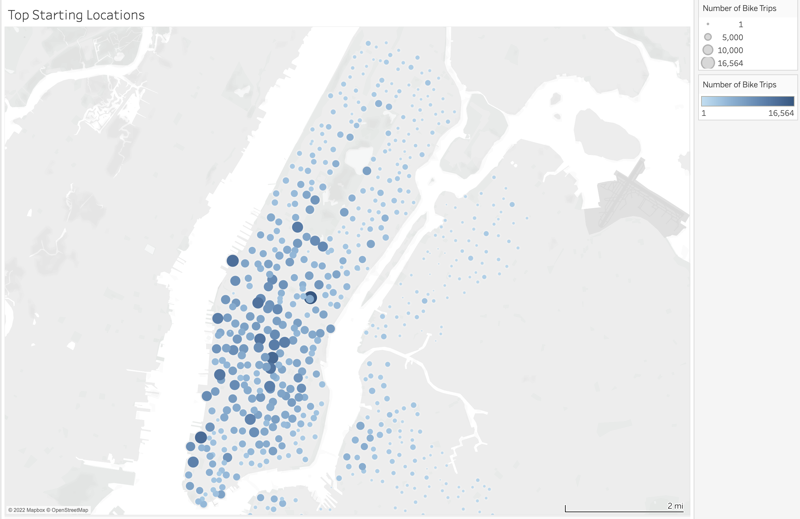
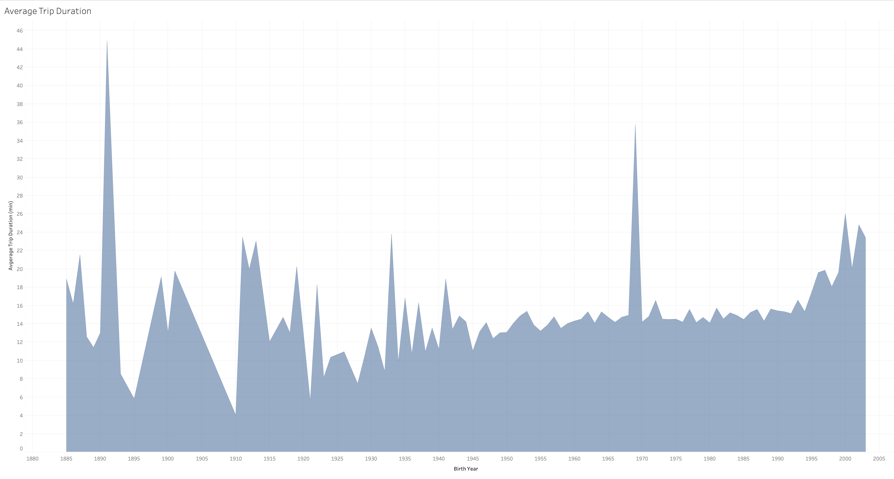
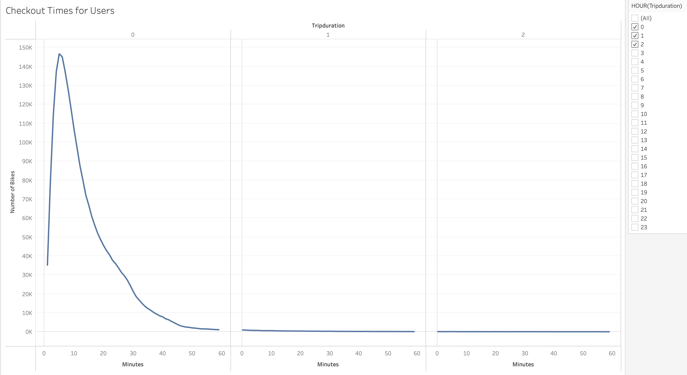
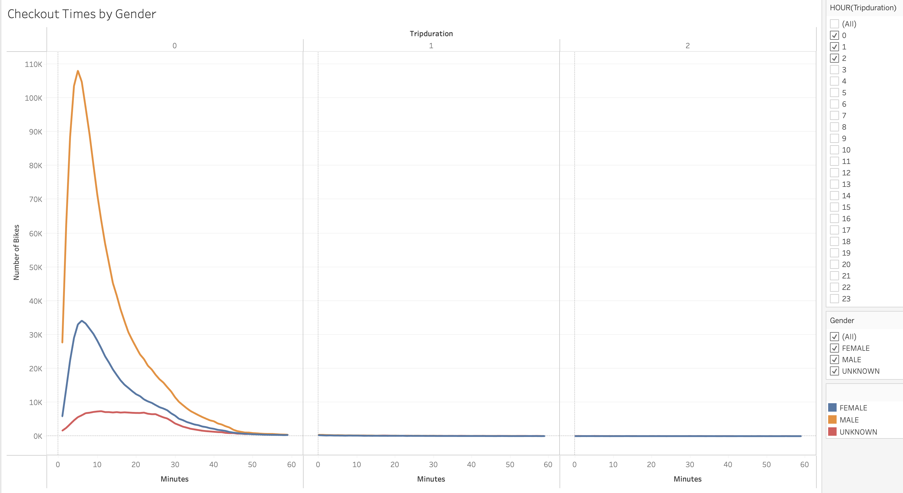
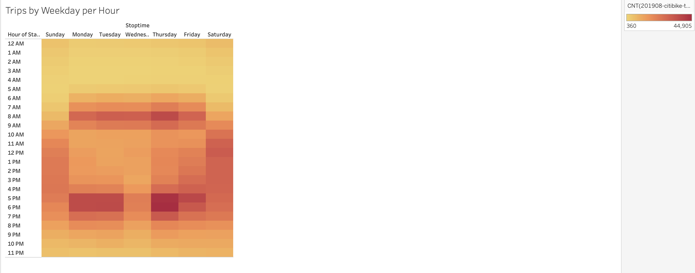
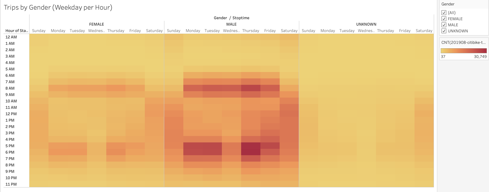
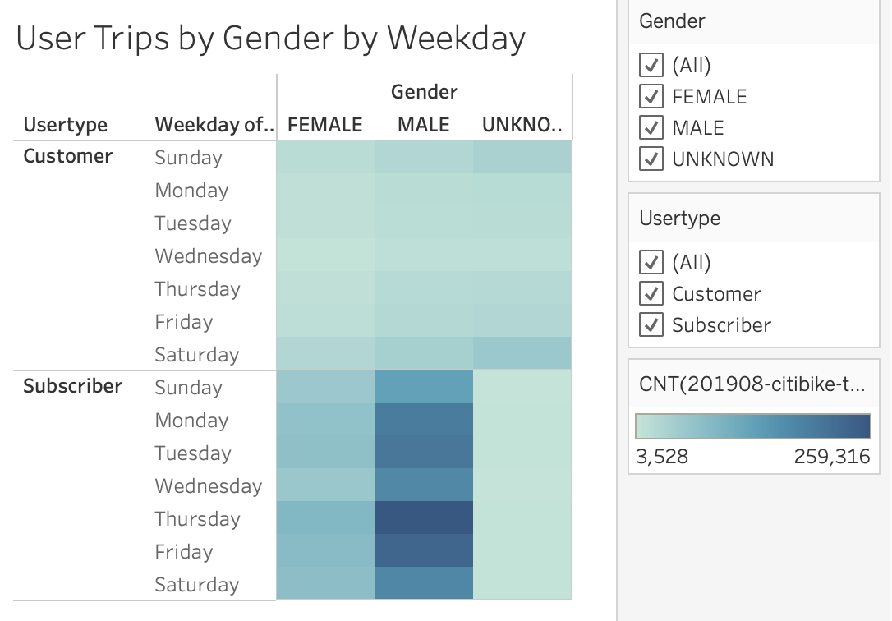

# New York City Citibike Bikesharing

An analysis of New York City Citibike Bikesharing during August 2019

## Overview

After observing successful bikesharing in New York City, we intend to start a similar bikesharing service in Des Moines, Iowa.

To inform potential investors, here is presented an analysis of the bikesharing business in New York City, focusing on bike trips. It is acknowledged that a bikesharing business is likely to be different in Des Moines than NYC.

This document not a business proposal, but an analysis to be used to support such a proposal.

## Results

The data used for this analysis comes from a NYC citibike trip histories CSV file which covers the month of August 2019.


Fig 1. Citibike trip histories column specifications.


### Convert `tripduration` Column

The `tripduration` column was converted from seconds (`int64` datatype) to the `datetime64[ns]` datatype. The Pandas code is as follows:

```
# 3. Convert the 'tripduration' column to datetime datatype.
citibike_data_df["tripduration"] = pd.to_datetime(citibike_data_df["tripduration"], unit = 's')
```
The purpose of the conversion is to allow better operability in Tableau.

The datafile was then exported without indices for use in Tableau:

```
# 5. Export the Dataframe as a new CSV file without the index.

# file to write
citibike_data_to_write = "201908-citibike-tripdata-new.csv"

# write the citibike-tripdata DataFrame
citibike_data_df.to_csv(citibike_data_to_write, index = False)
```


### NYC Bikesharing Overview

In August 2019, there were 2,344,224 rides taken on citibikes.

There are two types of citibike users: customers who get 1 or 3 day passes, and subscribers. About 80% of users are subscribers.

More males (~65%) than females (~25%) use citibikes.


Fig 2. The bikesharing overview. Left, number of rides. Center, the breakdown between customers and subscribers. Right, the breakdown by gender.


### Top Starting Locations

The top starting locations for citibike trips was plotted, where larger and darker blue circles indicate greater usage. The most heavily used location(s) originated 16,564 trips during August 2019. Note that each individual station can be distinctly observed.

The greatest number of trips originated in Manhattan. Some high volume stations are found in Hell's Kitchen, Midtown East, the southwest side of Lower Manhattan, and along the southwest side of Central Park. One can see the absence of stations within Central Park.


Fig 3. Distribution of citibike starting locations.

### Average Trip Duration by Age

The average trip duration for all ages is roughly 12 - 15 minutes long. Younger people tend to take longer citibike rides.

Note that someone born in 1940 in this dataset would be 79 years old, so birth years documented before 1940 should be taken with a grain of salt.


Fig 4. Average distribution of trip duration by age. Note that most data prior to 1940 is invalid.


### Citibike Trip Durations for All Riders and Genders

The frequency of citibike trip durations for all riders in August 2019 was calculated. Most riders rode for 4-7 minutes (mode = 5 minutes), and longer trip durations taper off. There were 146,752 (the maximum) riders who rode for 5 minutes, 5% of the maximum rode for 40 minutes, and 1% of the maximum rode for 55 minutes.


Fig 5. Average trip duration for all riders. Only trip durations of less than 3 hours are shown. 

Regarding gender, more men ride than women (see also fig. ). Their frequency distributions are almost identical for all riders, as they comprise about 90% of users.

About 10% of users do not specify their gender, and their ride duration frequency distribution is different from that of men and women. The maximum frequency for riders with unknown gender is a broad plateau spanning 7-25 minutes.  


Fig 6. Average trip duration by gender. Only trip durations of less than 3 hours are shown.

### Citibike Trips per Hour per Day of Week for All Riders and Genders

During any given hour on any given day, there are between 360-44,905 citibike rides starting. Weekday peak times are from 8-9 am and 5-7 pm. Weekend peak times are more broad from about 10 am to 7 pm, with more citibikers slightly preferring Sundays. 

There is a noticeable drop in ridership Wednesday evenings from 5-7 pm compared to the other weekdays.


Fig 7. Heatmap of trips per hour per day.

Once again there are more male citibikers than female. Also, their distributions are similar to that for all riders.

Citibike riders who do not specify their gender appear to ride mostly on weekends with the same late morning to early evening preferences that all riders have.


Fig 8. Heatmap of trips per hour per day by gender.


### Trips per Day of Week by User Type by Gender

Citibike customers appear to ride slightly more on weekends regardless of gender. Also, they ride more on weekends than males or females.

For citibike subscribers, the daily ride distributions are very similar for females and males. Because all subscribers specify their gender, there are no rides with unknown gender.


Fig 9. Number of trips taken each day of the week by user type (customer or subscriber) by gender.


### Tableau Story

A Tableau story documenting the results can be found here: 

[link to storyboard](https://public.tableau.com/app/profile/graeme.tank/viz/NYC_City_Bike_Analysis/NYCCitiBikeStory?publish=yes "link to storyboard")


## Summary

New York City is a busy place for citibiking. Each day, on the average, there were over 75,000 rides. Most of the rides occurred in Manhattan (fig. 3).

The majority of rides have a short duration (fig. 5 and fig. 6), most likely because riders use citibikes to cover "the last mile," the distance between subway or train station to place of work. This scenario is supported by the fact that most weekday rides are taken when commuters arrive to and return from work (figs. 7, 8, 9).

There is an interesting departure from normal evening workday riding behavior: there are far fewer rides taken Wednesday evenings (figs. 7, 8, 9). Consulting the historical weather data for August 2019 in New York City (not shown), there were only eight days of thunderstorms, but three of them occurred on the four Wednesdays of the month, which could have substantially hampered riding behavior.

Although fewer females citibike (fig. 2, right), their riding behavior appears indistinguishable from males (figs. 6, 8, 9). 

Riders of unknown gender are only user type customer, because all subscribers must specify their gender (fig. 9), and they have different riding habits: they take longer duration rides (fig. 6), and they ride primarily on weekends (figs. 8, 9). These riders are likely tourists who do not bother to specify their gender when signing up for a 1 or 3 day weekend pass.

Some suggestions for further visualizations involve the distance between starting and ending stations. A distance of zero is a round trip. One visualization would be the distribution of start-end distances as a function of weekday. Another visualization would be the distribution of start-end distances as a function of trip duration. These visualizations may help a bikesharing business understand how best to redistribute bicycles to minimize empty bikesharing stations.


