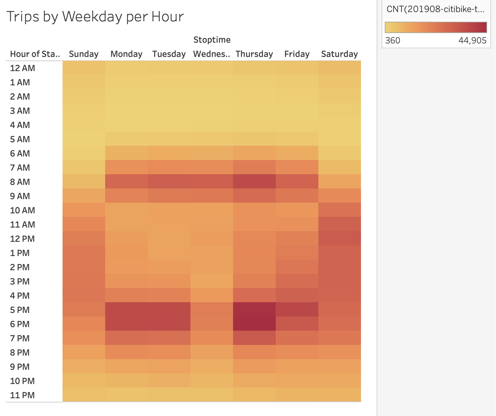

# New York City Citibike Bikesharing

An analysis of New York City Citibike Bikesharing during August 2019

## Overview

After observing successful bikesharing in New York City, we intend to start a similar bikesharing service in Des Moines, Iowa.

To inform potential investors, here is presented an analysis of the bikesharing business in New York City, focusing on bike trips. It is acknowledged that a bikesharing business is likely to be different in Des Moines than NYC.

This document not a business proposal, but an analysis to be used to support such a proposal.

## Results

The data used for this analysis comes from a NYC citibike trip histories CSV file which covers the month of August 2019.


### Convert `tripduration` Column

The `tripduration` column was converted from seconds (`int64` datatype) to the `datetime64[ns]` datatype. The Pandas code is as follows:

```
# 3. Convert the 'tripduration' column to datetime datatype.
citibike_data_df["tripduration"] = pd.to_datetime(citibike_data_df["tripduration"], unit = 's')
```
The purpose of the conversion is to allow better operability in Tableau.

The datafile was then exported without indices for use in Tableau:

```
# 5. Export the Dataframe as a new CSV file without the index.

# file to write
citibike_data_to_write = "201908-citibike-tripdata-new.csv"

# write the citibike-tripdata DataFrame
citibike_data_df.to_csv(citibike_data_to_write, index = False)
```


### NYC Bikesharing Overview

In August 2019, there were 2,344,224 rides taken on citibikes.

There are two types of citibike users: customers who get 1 or 3 day passes, and subscribers. About 80% of users are subscribers.

More males (~65%) than females (~25%) use citibikes.


### Top Starting Locations

The top starting locations for citibike trips was plotted, where larger and darker blue circles indicate greater usage. The most heavily used location(s) originated 16,564 trips during August 2019. Note that each individual station can be distinctly observed.

The greatest number of trips originated in Manhattan. Some high volume stations are found in Hell's Kitchen, Midtown East, the southwest side of Lower Manhattan, and along the southwest side of Central Park. One can see the absence of stations within Central Park.


### Average Trip Duration by Age

The average trip duration for all ages is roughly 12 - 15 minutes long. Younger people tend to take longer citibike rides.

Note that someone born in 1940 in this dataset would be 79 years old, so birth years documented before 1940 should be taken with a grain of salt.


### Citibike Trip Durations for All Riders and Genders

The frequency of citibike trip durations for all riders in August 2019 was calculated. Most riders rode for 4-7 minutes (mode = 5 minutes), and longer trip durations taper off. There were 146,752 (the maximum) riders who rode for 5 minutes, 5% of the maximum rode for 40 minutes, and 1% of the maximum rode for 55 minutes.


Regarding gender, more men ride than women (see also fig. ). Their frequency distributions are almost identical for all riders, as they comprise about 90% of users.

About 10% of users do not specify their gender, and their ride duration frequency distribution is different from that of men and women. The maximum frequency for riders with unknown gender is a broad plateau spanning 7-25 minutes.  


### How many trips are taken by the hour for each day of the week, for all riders and genders





### A breakdown of what days of the week a user might be more likely to check out a bike, by type of user and gender


### Tableau Story

A Tableau story documenting the results can be found here: 

[link to storyboard](https://public.tableau.com/app/profile/graeme.tank/viz/NYC_City_Bike_Analysis/NYCCitiBikeStory?publish=yes "link to storyboard")


## Summary


